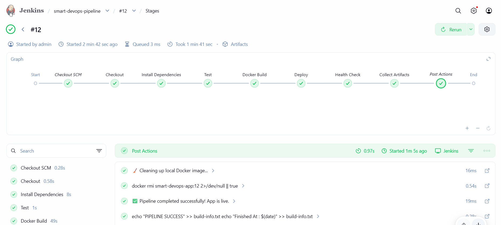
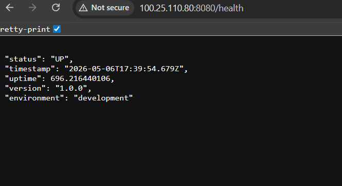
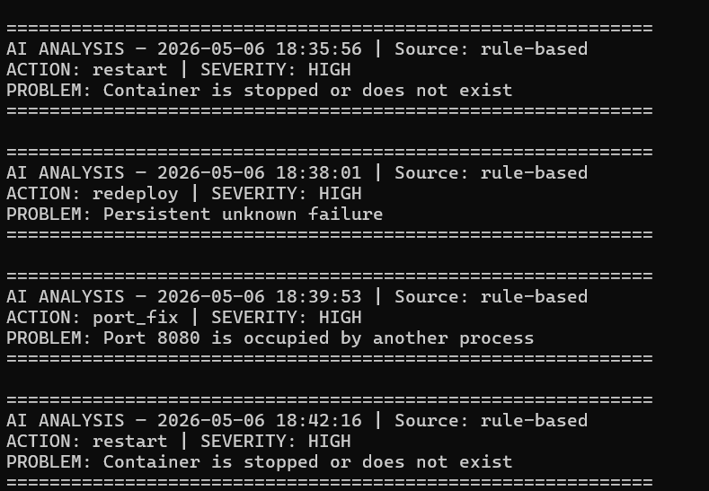
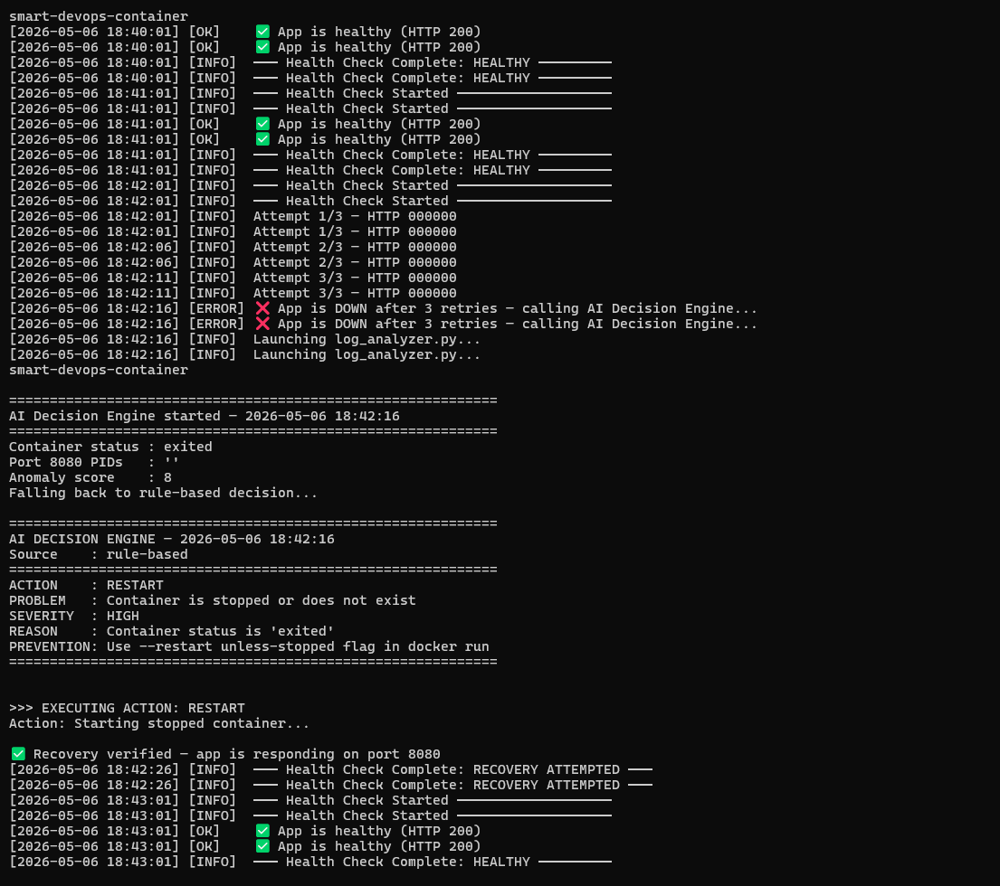
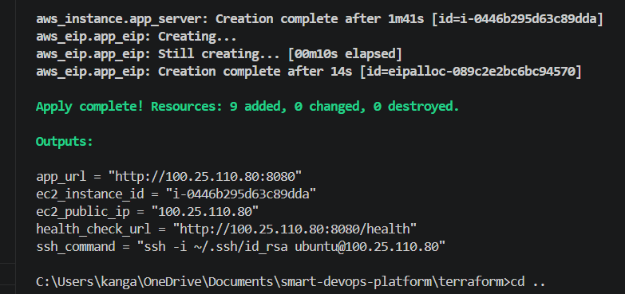

# 🧠 AI Self-Healing DevOps Platform

This project demonstrates how AI-driven infrastructure systems can automatically monitor applications, analyze production failures, make recovery decisions, and restore services without human intervention.

The platform continuously performs health monitoring, log analysis, anomaly detection, predictive failure monitoring, and automated recovery in real time.

The system can intelligently decide between restart, rebuild, Docker recovery, or full redeployment based on the detected failure scenario, creating a production-style self-healing infrastructure workflow.

---

## 📌 Current Project Status

The infrastructure used for testing and validation has been destroyed to avoid continuous AWS billing.

However, the complete Infrastructure-as-Code setup, automation scripts, AI engine, Jenkins pipeline, deployment configuration, logs, and proof screenshots are fully available in this repository.

The entire environment can be recreated anytime using Terraform.

---

# 🚀 Project Overview

This project is a production-style DevOps automation platform that can:

✅ Deploys application using Jenkins CI/CD  
✅ Run applications inside Docker containers  
✅ Provision infrastructure using Terraform on AWS EC2  
✅ Monitors application health continuously  
✅ Detects failures from logs + runtime state  
✅ Uses AI to decide recovery actions  
✅ Automatically fixes the system without human intervention  
  
The system combines:

- DevOps Automation
- AI-based Log Analysis
- Self-Healing Infrastructure
- Predictive Monitoring
- CI/CD Pipeline Automation

---

# 🏗️ Architecture

```text
GitHub Push
     ↓
Jenkins Pipeline
     ↓
Docker Build
     ↓
Docker Deploy on AWS EC2
     ↓
Health Monitoring Cron Job
     ↓
AI Log Analyzer
     ↓
Decision Engine
     ↓
Automatic Recovery Action
```

---

# ⚡ Core Features

## 🔄 CI/CD Automation

- Jenkins Pipeline Automation
- GitHub Integration
- Automatic Docker Build
- Automatic Docker Deployment
- Jenkins Docker Integration

---

## 🐳 Docker-Based Deployment

- Containerized application deployment
- Automatic restart policies
- Health check monitoring
- Resource isolation


---

## ☁️ Infrastructure as Code (Terraform)

Terraform automatically creates:

- AWS EC2 Instance
- Security Groups
- Elastic IP
- Network configuration

Infrastructure can be recreated anytime using:

```bash
terraform init
terraform apply
```

---

# 🤖 AI-Powered Self-Healing System

AI analyzes:

- Container status
- Crash logs
- HTTP failures
- Port conflicts
- Log anomalies
- Restart patterns

When a problem occurs, AI analyzes logs and decides the best recovery action.

---

# 🔍 Predictive Monitoring (Level 4)

The platform also attempts to predict failures before total downtime.

It tracks:

- Increasing restart frequency
- Repeated HTTP failures
- Error spikes
- Crash trends
- Container instability

This allows preventive recovery before the application fully crashes.

---

# 🧰 Tech Stack

| Category | Technologies |
|---|---|
| Cloud | AWS EC2 |
| Infrastructure | Terraform |
| Containerization | Docker |
| CI/CD | Jenkins |
| Scripting | Bash |
| AI Engine | Python |
| Monitoring | Cron + Custom Health Checks |
| AI APIs | OpenAI |
| Version Control | Git + GitHub |

---

# 📸 Live Demo Proof

> ⚠️ AWS EC2 infrastructure is destroyed after testing to avoid unnecessary AWS billing.
> The screenshots below were captured from the live running infrastructure.

| Feature | Screenshot |
|---|---|
| ✅ Jenkins Pipeline Success |  |
| ✅ Application Health UP |  |
| ✅ AI Log Analysis |  |
| ✅ Self-Healing Recovery |  |
| ✅ Terraform Infrastructure Output |  |

---

# 📜 Sample AI Decision Logs

## Example 1 — Container Recovery 

```text
ACTION     : RESTART
PROBLEM    : Container is stopped but image is healthy
SEVERITY   : HIGH
REASON     : Container status is exited
PREVENTION : Use restart policies
```

---

## Example 2 — Port Conflict Recovery

```text
ACTION     : PORT_FIX
PROBLEM    : Port 8080 already in use
SEVERITY   : HIGH
REASON     : Another process occupied the application port
PREVENTION : Validate port availability before deployment
```

---

## Example 3 — Predictive Recovery

```text
ACTION     : REDEPLOY
PROBLEM    : Repeated instability detected
SEVERITY   : CRITICAL
REASON     : Multiple restarts detected within short interval
PREVENTION : Add resource monitoring and scaling
```

---

# 🔥 How Self-Healing Works

## Step 1 — Health Monitoring

Cron job continuously executes:

```bash
/opt/scripts/health_check.sh
```

The script checks:

- Docker container state
- HTTP health endpoint
- Restart count
- Application response

---

## Step 2 — AI Log Analysis

If a failure is detected:

```bash
python3 /opt/ai-engine/log_analyzer.py
```

The analyzer:

- Reads recent logs
- Detects anomalies
- Identifies failure patterns
- Uses AI for reasoning
- Chooses recovery action

---

## Step 3 — Automatic Recovery

Recovery actions are executed automatically:

```bash
bash /opt/scripts/auto_fix.sh
```

---

# ☁️ Cost Optimization Note

AWS EC2 instance is stopped after validation to avoid continuous billing.

Infrastructure can be recreated anytime using:
```bash
cd terraform
terraform init
terraform apply
```
---

# 🧪 Failure Simulation Testing

## Test 1 — Container Stop Recovery

```bash
docker stop smart-devops-container
python3 /opt/ai-engine/log_analyzer.py
```

Expected:

```text
ACTION : RESTART
```

---

## Test 2 — Port Conflict Recovery

```bash
docker stop smart-devops-container
docker rm smart-devops-container
nc -lk 8080 &
python3 /opt/ai-engine/log_analyzer.py
```

Expected:

```text
ACTION : PORT_FIX
```

---

## Test 3 — Unknown Failure Recovery

```bash
docker stop smart-devops-container
docker rm smart-devops-container
python3 /opt/ai-engine/log_analyzer.py
```

Expected:

```text
ACTION : REDEPLOY
```

---

# 📈 Why This Project Is Different From Kubernetes

| Feature | This AI Platform | Kubernetes |
|---|---|---|
| AI-based failure reasoning | ✅ | ❌ |
| Automatic root cause analysis | ✅ | ❌ |
| Self-healing decisions  | ✅ | Partial |
| Human-like troubleshooting | ✅ | ❌ |
| Container orchestration | Basic | Advance |
| Learning purpose | AI DevOps logic | Infra orchestration |

## Key Point:

Kubernetes handles orchestration.
This project focuses on intelligent decision-making during failures.

---

# 🌟 Key Highlights

 Built an AI-powered self-healing DevOps platform using Docker, Jenkins, Terraform, AWS EC2, and Python that automatically detects, analyzes, predicts, and recovers from infrastructure and application failures using intelligent decision-based automation.

---

# ⭐ Future Improvements

- Kubernetes integration
- Prometheus + Grafana monitoring
- ML-based failure prediction model
- Multi-node distributed healing
- Slack / Email alert system
- CloudWatch integration

---

# 👨‍💻 Author

Ashish Kangale

DevOps Engineer | Cloud & Infrastructure Automation Enthusiast

Interested in building AI-powered infrastructure systems, self-healing platforms, CI/CD automation pipelines, and cloud-native DevOps solutions using Docker, Terraform, Jenkins, AWS, Python, and Linux.

---
